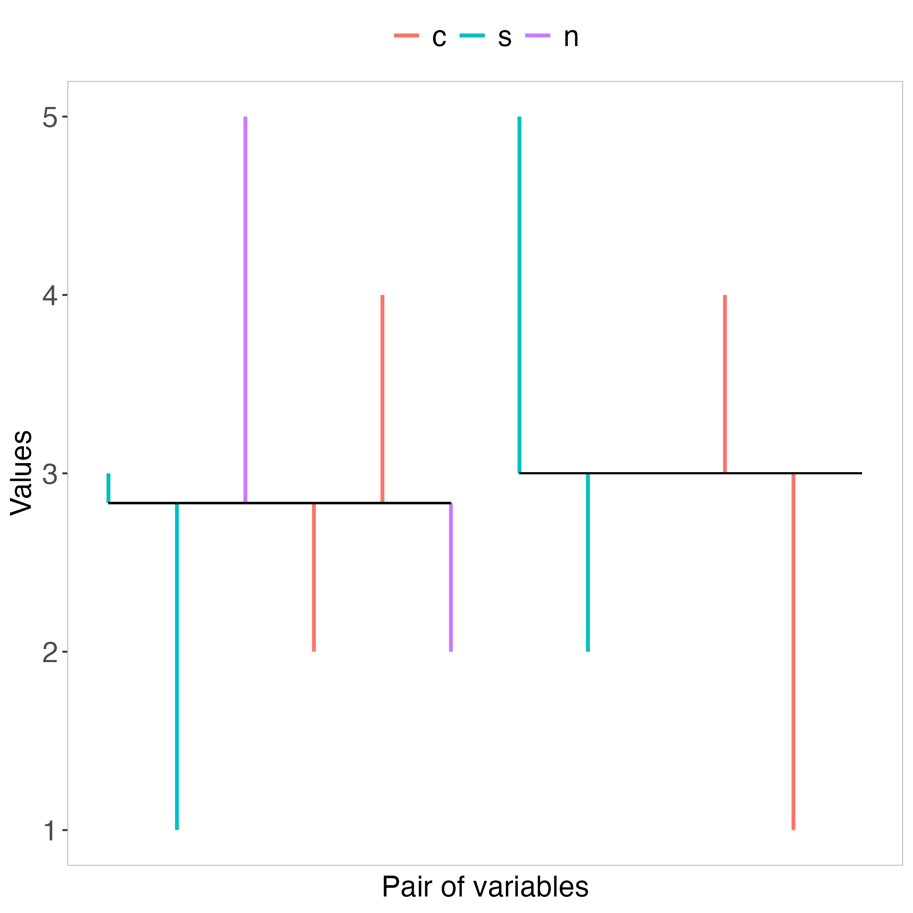

```{r setup, include=FALSE}
knitr::opts_chunk$set(echo = TRUE)
```

# Correlatio

This R package can help visualizing what is summarized in Pearson's correlation coefficient **r**. In a way, it can make visible the main part of **r**, which is a single number that ranges between -1 and 1. This possibility may be particularly helpful for people who do not fully understand Pearson's correlation coefficient, unless they can also look at the main part of **r**, in addition to what is usually presented only verbally, and with formulas, numbers, and heatplots.

## Why correlatio?

Main reason: Etymology of 'correlation' is 'correlatio'. First: 'cor-', meaning 'with, together' or com- (from Latin cum), meaning 'together, together with, in combination'. Second: 'relation' (from Latin relatio), meaning 'a bringing back, restoring'.

Source: [https://www.etymonline.com/word/correlation](https://www.etymonline.com/word/correlation)

Other reason: There are plenty of R packages which provide all sorts of possibilities regarding correlation, except for what this correlatio package offers. These other packages, which I was able to find, are called: [correlation](https://easystats.github.io/correlation/), [corrr](https://corrr.tidymodels.org/), [simstudy](https://CRAN.R-project.org/package=simstudy) (see simstudy Vignettes 'Correlated data'), [ppcor](https://CRAN.R-project.org/package=ppcor), [corrmorant](https://github.com/r-link/corrmorant), [corrgrapher](https://modeloriented.github.io/corrgrapher/), [linkspotter](https://linkspotter.sigmant.net/index.html).

## Download of this correlatio R package

This correlatio R package can be downloaded from CRAN. Alternatively, from GitHub, e.g., by running these lines of code in R:
```{r echo=TRUE, eval = FALSE}
# Note: The R package devtools must have been installed, in order for this line of code to work:
devtools::install_github(repo="https://github.com/mmiche/correlatio",
                      dependencies = "Imports", build_vignettes = TRUE)
```

## Correlatio uses the R packages base and stats, and:

```{r echo=TRUE, eval = FALSE}
library(ggplot2) # version 3.5.1 (Download from CRAN)
library(tibble) # version 3.2.1 (Download from CRAN)
```

{width=500pt}

<br>
Figure 1 shows what the etymology of the word correlation says: Together, i.e., in pairwise combination, bringing who knows what back from the tip (turquoise or red) to the respective mean.

# Why would anybody want to see Figure 1?

First, why not? Some people might benefit, while nobody gets harmed. Second, in some scientific fields, a visualization of this kind may contribute to better, i.e., more thoroughly informed, scientific decisions. It may also contribute to fruitful discussions about whether or not assuming a continuous scale for one or more theoretical constructs can be defended (Heine and Heene, 2024; Feuerstahler, 2023).

Furthermore, Pearson's correlation coefficient is the basis, upon which every version of linear regression modeling rests. That is, if computing correlations cannot be defended, then using linear regression models also cannot be defended. At the very least, visualizing the most important part of **r** may increase researchers' awareness of limitations, regarding real-world validity of constructs, which otherwise can easily be overlooked or forgotten (Zyphur 2020a, 2020b; Zorich, 2025; Gardner and Neufeld, 2013).

## The simulated data of Figure 1

```{r test1, eval = TRUE}
# Set seed to guarantee reproducibility.
set.seed(13)
testSim <- correlatio::simcor(obs=6, rhos = c(.5, .6, .7))
test1 <- correlatio::corrio(data=testSim[[1]], visualize = TRUE)
test1$dat
```

There are many more details in the output 'details', such as the mean of x and y, respectively.

```{r test1Details, eval = TRUE}
test1$details
```

## Linearly transform the simulated data

In order to obtain values which more resemble data from our specific research field, the function 'lineartransform' can be used. Let's apply this function to the three datasets in testSim. For example, the values in each variable shall range between 1 and 5, with 0 decimal digits, i.e., only integer values. Due to rounding the transformed values, the previous correlation will change somewhat.

```{r test2a, eval = TRUE}
testSimTransformed <- lapply(testSim, function(x) {
    apply(x, 2, function(y) {
        correlatio::lineartransform(futureRange = c(1, 5), vec = y, digits = 0)
    })
})
```

Now we run the 'corrio' function again, this time with the first of the three datasets of testSimTransformed. This will be followed by the numeric output and the visualization.

```{r test2b, eval = TRUE}
test2 <- correlatio::corrio(data=testSimTransformed[[1]])
test2$dat
```

The visualization can be seen in Figure 2.

{width=500pt}

<br>
In Figure 2 we see that for the third and the sixth value, the y variable contains two values which are identical with the mean of y, namely 3. Therefore the legend of Figure 2 shows n for 'no direction', i.e., these pairwise combinations cannot be determined, because one of the pair of values goes in no direction.

# Conclusion

The visualizations of this correlatio package may appear uninformative, once each variable contains 10, 20, or far more values. However, even then someone might come up with interesting ideas of how to benefit from this type of visualization. For example, assume you have 200 observations for a correlated pair of variables. You might want to randomly sample a subset of 10 or 20 values from the 200 observations, and look at the resulting plot while trying to figure out why it looks the way it does.

# What if?

What if you wanted to visualize two correlated variables that have extremely different values? Example pair of such variables:

```{r whatif, eval = TRUE}
v1 <- c(6.58, 7.02, 6.95, 8.6, 6.81, 6.75, 7.65)
v2 <- c(176, 302, 194, 325, 318, 309, 275)
```

If these two variables were to be visualized in the same plot, the distances between v1 and the mean of v1 would not be visible, because the values of v2 determine the y-axis of the plot. In such a case, z-transform both variables, before visualizing them. The correlation between v1 and v2 is .44.

```{r whatifSolve, eval = TRUE}
test3 <- correlatio::corrio(data=data.frame(z1=scale(v1), z2=scale(v2)), visualize = TRUE)
test3$dat
```

The visualization can be seen in Figure 3.

{width=500pt}

<br>
```{r echo=TRUE, eval = FALSE}
# sessionInfo()
R version 4.4.0 (2024-04-24)
Platform: x86_64-apple-darwin20
Running under: macOS Sonoma 14.2.1

Matrix products: default
BLAS:   /System/Library/Frameworks/Accelerate.framework/Versions/A/Frameworks/vecLib.framework/Versions/A/libBLAS.dylib 
LAPACK: /Library/Frameworks/R.framework/Versions/4.4-x86_64/Resources/lib/libRlapack.dylib;  LAPACK version 3.12.0

locale:
[1] en_US.UTF-8/en_US.UTF-8/en_US.UTF-8/C/en_US.UTF-8/en_US.UTF-8

time zone: Europe/Zurich
tzcode source: internal

attached base packages:
[1] stats     graphics  grDevices utils     datasets  methods   base     

other attached packages:
[1] correlatio_0.1.0

loaded via a namespace (and not attached):
 [1] generics_0.1.3    stringi_1.8.4     digest_0.6.37    
 [4] magrittr_2.0.3    evaluate_1.0.3    grid_4.4.0       
 [7] pkgload_1.3.4     fastmap_1.2.0     processx_3.8.3   
[10] pkgbuild_1.4.3    sessioninfo_1.2.2 urlchecker_1.0.1 
[13] ps_1.6.0          promises_1.2.0.1  purrr_1.0.4      
[16] scales_1.3.0      Rdpack_2.6.2      cli_3.6.3        
[19] shiny_1.9.0       rlang_1.1.5       rbibutils_2.3    
[22] ellipsis_0.3.2    munsell_0.5.1     yaml_2.3.10      
[25] withr_3.0.2       remotes_2.4.2     cachem_1.1.0     
[28] devtools_2.4.5    tools_4.4.0       memoise_2.0.1    
[31] dplyr_1.1.4       colorspace_2.1-1  ggplot2_3.5.1    
[34] httpuv_1.6.5      curl_5.2.1        vctrs_0.6.5      
[37] R6_2.5.1          mime_0.12         lifecycle_1.0.4  
[40] stringr_1.5.1     fs_1.6.5          htmlwidgets_1.6.4
[43] usethis_2.1.6     miniUI_0.1.1.1    pkgconfig_2.0.3  
[46] desc_1.4.3        callr_3.7.6       pillar_1.10.1    
[49] later_1.3.0       gtable_0.3.6      rsconnect_0.8.26 
[52] glue_1.8.0        profvis_0.3.7     Rcpp_1.0.14      
[55] xfun_0.50         tidyselect_1.2.1  tibble_3.2.1     
[58] knitr_1.49        rstudioapi_0.17.1 farver_2.1.2     
[61] xtable_1.8-4      htmltools_0.5.8.1 rmarkdown_2.29   
[64] labeling_0.4.3    compiler_4.4.0
```

**References**

Feuerstahler, L. (2023). Scale type revisited: Some misconceptions, misinterpretations, and recommendations. *Psych*. [DOI](https://doi.org/10.3390/psych5020018)

Gardner, R. C., & Neufeld, R. W. (2013). What the correlation coefficient really tells us about the individual. *Canadian Journal of Behavioural Science/Revue canadienne des sciences du comportement, 45*(4), 313-319. [DOI](https://doi.org/10.1037/a0033342)

Heine, J.-H., & Heene, M. (2024). Measurement and mind: Unveiling the self-delusion of metrification in psychology. *Measurement: Interdisciplinary Research and Perspectives*. [DOI](https://doi.org/10.1080/15366367.2024.2329958)

Zyphur, M. J., & Pierides, D. C. (2020a). Statistics and probability have always been value-laden: An historical ontology of quantitative research methods. *Journal of Business Ethics, 167*(1), 1-18. [DOI](https://doi.org/10.1007/s10551-019-04187-8)

Zyphur, M. J., & Pierides, D. C. (2020b). Making quantitative research work: From positivist dogma to actual social scientific inquiry. *Journal of Business Ethics, 167*, 49-62. [DOI](https://doi.org/10.1007/s10551-019-04189-6)

Zorich, J. N. (2025). *The History of Correlation*. Taylor & Francis. [DOI](https://doi.org/10.1201/9781003527893)